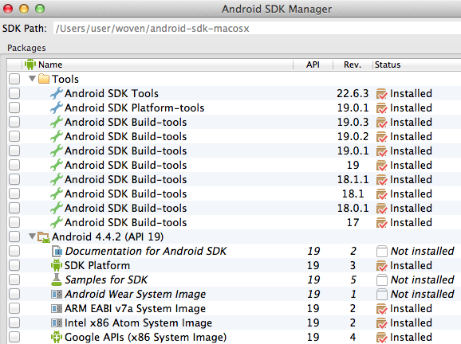

#### Getting Started

This document is written for OS X. Appium does not yet work on Windows.
Appium Android should run on Linux however iOS testing requires OS X.

- Clone appium_console

`$ git clone git://github.com/appium/ruby_console.git`

- Ensure you have Ruby 1.9.3+ (1.8 is not supported). Install the latest stable patch release of Ruby 1.9.3 (not Ruby 2.0).

`\curl -L https://get.rvm.io | bash -s stable --ruby=1.9.3`

`$ ruby --version`

- Install appium_console gem.

`gem install appium_console`

- Export APP_PATH, APP_PACKAGE, APP_ACTIVITY

```
export APP_PATH="`pwd`/my.apk" ;\
export APP_PACKAGE="com.my.Pkg" ;\
export APP_ACTIVITY="MyActivity"
```

- Echo the values to make sure they're set correctly

`$ echo $APP_PATH $APP_PACKAGE $APP_ACTIVITY`

- Install [nodejs](http://nodejs.org/)

`$ node --version`

`$ npm --version`

- Install grunt.

` sudo npm install -g grunt grunt-cli`

```bash
$ grunt --version
grunt-cli v0.1.6
grunt v0.4.1
```

- Clone appium

`$ git clone git@github.com:appium/appium.git`

- Run reset.sh. You may have to run this twice as described below due to permission issues.

`cd appium; sudo ./reset.sh; ./reset.sh`

- Start appium. `-V` enables verbose and `--fast-reset` enables fast rest for Android.

`node server.js -V --fast-reset`

- Install dmg [hax module](http://software.intel.com/en-us/articles/intel-hardware-accelerated-execution-manager). See the [install guide](http://software.intel.com/en-us/articles/installation-instructions-for-intel-hardware-accelerated-execution-manager-macosx).
  - [Direct link to hax module dmg](http://software.intel.com/sites/default/files/article/184952/intelhaxm-1.0.4-hotfix-androidonmac.zip)

- Use intel [system image](http://software.intel.com/en-us/articles/android-4-2-jelly-bean-x86-emulator-system-image) at least API 17 (Jelly Bean)

- Install using Android package tool. For API 17, install `SDK Platform`, `Intel x86 Atom System Image`, `Google APIs` as in the picture. 
If there are any problems viewing or downloading the packages, go to `Packages -> Reload` and try again.

`android`



- Create a new Android virtual device that uses the Intel image.

`android avd`


- Check that `hax is working`


- After launching the emulator, check that it's listed in adb devices. Run the following commands a few times until it's listed.

`adb kill-server; adb devices`

If you see `error: protocol fault (no status)` just keep running the command until the emulator is detected.
